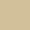

# Muted Theme

> A Muted colors in dark and light theme with a subtle touch of rich color

## Color Palette

| Palette      | Semantic   | Hex       | RGB             | 🌈                             |
| ------------ | ---------- | --------- | --------------- | ------------------------------ |
| Darker Gray  |            | #323232   | (50, 50, 50)    |    |
| Dark Gray    | Background | #383838   | (56, 56, 56)    |    |
| Light Gray   | Comment    | #616161   | (97, 97 ,97)    |    |
| White        | Text       | #E0E0E0   | (224, 224, 224) |    |
| Pure White   |            | #FFFFFF   | (255, 255, 255) |    |
| Gold         | String     | #DCCAA9   | (220, 202, 169) |    |
| Lighter Gold |            | #DCCAA955 | (220, 202, 169) |  |
| Orange       | Attributes | #DC944D   | (220, 148, 77)  |    |
| Pink         | Keyword    | #F6D2DE   | (246, 210, 222) |    |
| Lighter Pink |            | #F6D2DE11 | (246, 210, 222) |  |
| Red          | Error      | #B05C52   | (176 ,92, 82)   |    |
| Purple       |            | #6D708B   | (109, 112, 139) |    |
| Green        | Variable   | #659E65   | (101, 158, 101) |    |
| Blue         | Function   | #8DACB4   | (141, 172, 180) |    |
