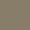

# Muted Theme

> A Muted colors in dark and light theme with a subtle touch of rich color

## Install

TBDD

## Color Palette

| Palette     | Hex     | RGB             | Color                        |
| ----------- | ------- | --------------- | ---------------------------- |
| Background  | #383838 | (56, 56, 56)    |  |
| Background2 | #323232 | (50, 50, 50)    |  |
| Foreground  | #E0E0E0 | (224, 224, 224) |  |
| Comment     | #9A8F7B | (154, 143 ,123) |  |
| Gold        | #DCCAA9 | (220, 202, 169) |  |
| Green       | #659E65 | (101, 158, 101) |  |
| Red         | #B05C52 | (176 ,92, 82)   |  |
| Pink        | #F6D2DE | (246, 210, 222) |  |
| Orange      | #DC944D | (220, 148, 77)  |  |
| Blue        | #8DACB4 | (141, 172, 180) |  |
| Purple      | #6D708B | (109, 112, 139) |  |
