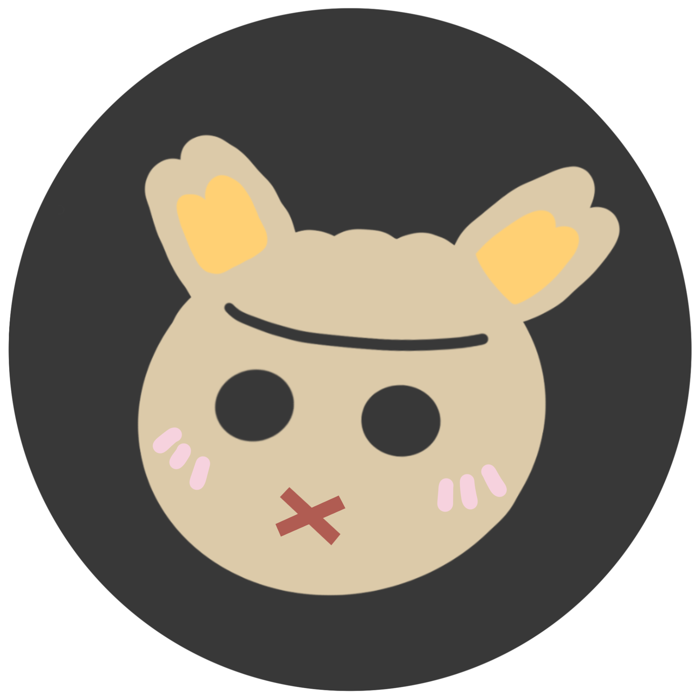

# Muted Theme

> A Muted colors in dark and light theme with a subtle touch of rich color

# Screenshot

> a work in progress theme

## Supported Languages

-   [x] Markdown \*.md & Logs \*.log
-   [x] JSON \*.json & YAML \*.yaml
-   [x] Hypertext Markup Language \*.html
-   [x] Content Style Sheet \*.css
-   [x] Javascript \*.js & Typescript \*.ts
-   [] Python

## Color Palette

| Palette       | Semantic           | Hex     | RGB             | 🌈                           |
| ------------- | ------------------ | ------- | --------------- | ---------------------------- |
| Darker Gray   |                    | #323232 | (50, 50, 50)    |  |
| Dark Gray     | Background         | #383838 | (56, 56, 56)    |  |
| Gray          | Comment            | #A3A3A0 | ()              |  |
| White         | Variable, Operator | #E0E0E0 | (224, 224, 224) |  |
| Pure White    |                    | #FFFFFF | (255, 255, 255) |  |
| Gold          | String             | #DCCAA9 | (220, 202, 169) |  |
| Yellow        | Function, Support  | #FFD074 | ()              |  |
| Orange        | Constant Numeric   | #DC944D | (220, 148, 77)  |  |
| Pink          | Variable Parameter | #F6D2DE | (246, 210, 222) |  |
| Red           | Error              | #B05C52 | (176 ,92, 82)   |  |
| Lighter Red   | Keyword            | #FF7676 |                 |  |
| Purple        |                    | #6D708B | (109, 112, 139) |  |
| Green         | Other Variable     | #7CAD7C | (101, 158, 101) |  |
| Lighter Green |                    | #87DC7A | (101, 158, 101) |  |
| Blue          | Attribute          | #8DACB4 | (141, 172, 180) |  |
| Lighter Blue  | Links              | #3FBABE | (141, 172, 180) |  |
